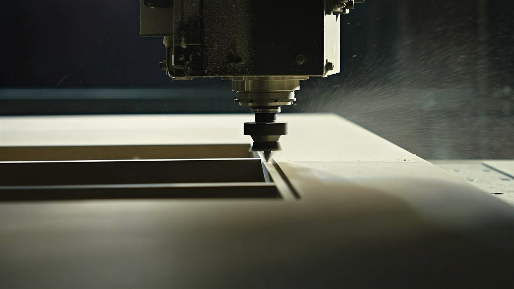

# Social Media Marketing Plan — Cabinet Door Manufacturing

**Prepared for:** Bryan — Custom Woodworking LLC
**Prepared by:** Devon H.
**Date:** June 2026
**Channels:** Facebook · Instagram · TikTok
**Engagement type:** Done-for-you social media management & lead generation

---

## 1. Summary

This is a business-to-business marketing plan. The goal is simple: put a steady,
predictable stream of qualified cabinet-shop leads in front of Custom Woodworking LLC, at a known
cost per lead, using Facebook, Instagram, and TikTok.

The strategy runs on two engines. The first is **proof of craft**: a steady stream of short
product and process videos that builds credibility and earns reach organically, with no ad
spend. The second is a single always-on paid campaign that turns that attention into leads,
captured directly inside Facebook and Instagram. As the program proves its cost per lead, we
scale spend and geography deliberately rather than guessing up front.

> **The one promise everything ladders up to:**
> **"The dependable door partner your shop can build on."**

---

## 2. Who We're Talking To

Marketing aimed at the wrong audience is the single
most common way ad budgets get wasted. Our buyer:

| Buyer | What they care about | Where they are |
|-------|---------------------|----------------|
| **Cabinet shops** | Consistent doors they can finish & resell, on time | FB, IG, FB Groups |
| **Kitchen & bath remodelers** | Predictable supply, clean primed surfaces, fewer callbacks | IG, FB |
| **General contractors / builders** | One dependable source, volume pricing | FB, IG |
| **Cabinet refacing companies** | Door range + finish options in matching profiles | IG, FB |

A purchasing decision-maker at a cabinet shop is a normal person who scrolls Facebook and
Instagram in the evening. Recent industry data shows **nearly half of B2B decision-makers
use Facebook for business research** — Meta is not just a consumer platform. We meet them
where they already are, with content that respects that they're a professional, not a
weekend DIYer.

---

## 3. Positioning & Message Pillars

Every post, ad, and video maps back to one of four pillars. Each pillar is built to mitigate a
specific fear that makes a cabinet shop hesitate to switch suppliers.

| Pillar | What we say | The buyer fear it removes |
|--------|-------------|---------------------------|
| **Consistency** | Same profile, same dimensions, every single order | "My last supplier's doors didn't match between batches" |
| **Stability** | MDF doesn't expand or contract — it won't crack, swell, or warp like 5-piece solid wood | Warranty callbacks and unhappy customers |
| **Finish-ready** | Factory primer gives a smooth, uniform, paint-ready surface and saves prep labor on site | Wasted shop hours sanding and sealing |
| **Range & flexibility** | Large profile range, available raw / sanded / primed | "I have to source doors from three different places" |

---

## 4. Platform Strategy

Each platform has a distinct job. We do not post identical content everywhere blindly — we
repurpose one batch of source assets into platform-appropriate cuts.

| Platform | Primary job | Content style |
|----------|-------------|---------------|
| **Instagram** | Flagship portfolio + Reels — the visual credibility library | Polished product shots, finish comparisons, Reels |
| **Facebook** | Same content + **the paid lead engine** + local Group presence | Lead-form ads, posts, participation in cabinet/contractor Groups |
| **TikTok** | Top-of-funnel reach — get discovered by new shops | Same Reels cross-posted; raw, low-polish cuts perform best here |

**Why low-polish video works on TikTok:** in the woodworking/CNC niche, unscripted "watch
this get made" content consistently outperforms over-produced ads. We lean into it — it's
cheaper to make *and* it performs better.

---

## 5. The Funnel — How a Stranger Becomes a Lead

1. **Attract** — short video and finish-comparison posts earn reach and saves. Shops that
   would never click an ad will watch a 15-second "raw vs. primed" clip.
2. **Capture** — instead of sending people to a website (where most drop off), we use
   **Facebook/Instagram instant lead forms** that pre-fill the user's contact info inside
   the app. Industry benchmarks show these convert **2–3× better** than website-click ads.
3. **Nurture** — anyone who watched our video or engaged with the page gets retargeted, and
   new leads get a prompt DM/email reply.
4. **Close** — the hook is a **free, no-obligation quote** on the shop's next door order.
   It's a low-friction ask that turns an interested shop into a real conversation: we learn
   what they need, they get fast pricing, and the relationship starts. Quote request →
   pricing → order.

---

## 6. Content Engine (Done-For-You System)

A repeatable system is what separates a sustainable program from a burst of posts that
fizzles out. Content rotates through a set of recurring content buckets so the feed stays
varied and every post has a job. *(The specific buckets will be defined with Custom
Woodworking LLC.)*

**Production cadence (per week):**
- 2 short videos (Reels), cut from one monthly batch of source material
- 1 static or carousel post
- Each asset repurposed across IG and FB, then cross-posted to TikTok — one batch of source
  material becomes many posts, with no separate TikTok shoot

**Asset pipeline (fully remote):** each month the client sends one **batch of raw source
material** — product photos, logos and brand files, and any quick phone footage of the
shop or product captured from a **simple shot list we provide**. Where the client can't
supply a particular shot, we source appropriate licensed/stock visuals. We then handle all
editing, scheduling, and posting remotely. This keeps the client's time commitment to about
an hour or two a month and requires no on-site production.

---

## 7. Paid Advertising Structure

Two campaigns, kept deliberately simple:

1. **Always-on Lead Generation** — instant lead-form ads targeting cabinet makers, kitchen
   & bath pros, remodelers, and GCs by **job title and interest**. Offer = free quote. Once
   we have ~50+ leads, we add **lookalike audiences** built from real buyers.
2. **Retargeting** — re-engages anyone who watched ≥ a few seconds of our video or engaged
   with the page. Cheapest, highest-intent audience we have.

**Creative testing discipline:** keep 3–4 ad creatives live at once, review on a steady
cadence — roughly every two weeks at starter spend, where enough data has accumulated to act
on — kill the losers, and put budget behind winners. This is a proven, time-tested discipline
with a long track record of steadily driving down cost per lead — not guesswork with the
client's budget.

---

## 8. Budget Scenarios

Ad budget is set with the client. Below are three starting points; all figures are **ad
spend paid to Meta**, separate from your management fee. Lead estimates are planning ranges
that we replace with real numbers after the first 30 days.

| Tier | Monthly ad spend | What it funds | Rough expected leads/mo* |
|------|------------------|---------------|--------------------------|
| **Lean** | $300 | Organic engine + light post boosting | 5–15 |
| **Starter** | $800 | + one always-on lead campaign | 15–40 |
| **Growth** | $2,000 | + retargeting, lookalikes, faster testing | 40–100 |

\*Ranges are illustrative for a regional B2B audience and will vary by geography, offer
strength, and creative. We commit to **measured** numbers after the first month, not
promises before it.

**Recommendation:** start at **Starter ($800)** for 30–60 days to find a real cost-per-lead,
then decide whether to scale to Growth. The Lean tier is a valid "test the waters" entry if
the client wants to start smaller.

---

## 9. Geographic Focus

We concentrate ad spend on **Custom Woodworking LLC's existing market area** — the regions they
already serve and can fulfill today. This keeps every dollar pointed at shops the client
can actually do business with, rather than paying to reach areas outside their reach.

As the program matures and we learn more about the client's fulfillment range, we can
revisit the targeting radius together and widen it where it makes sense.

---

## 10. Measurement & Reporting

We manage to numbers, not vibes. Tracked monthly:

- **Cost per lead (CPL)** — the headline metric
- **Lead → quote rate** and **quote → order rate** (with client input)
- **Organic reach, saves, and follower growth**
- **Retargeting return on ad spend (ROAS)**

Deliverable: a **one-page monthly report** in plain English — what we spent, what came in,
what we're changing next month. No jargon dumps.

---

## 11. Ad Creative — Rough Drafts

Four starting concepts, each tied to a pillar. These are **directions to build on** — final
ads should use Custom Woodworking LLC's real product photos and shop footage, which will always
outperform stock or AI concept images. Two sample concept images are included as visual
stand-ins:

| Concept image | Use |
|---------------|-----|
|  | Concept C hero — clean primed-stack with headline space on top *(final ad should swap in a real photo showing the shaker profile)* |
|  | Concept A "Process / Flatness" Reel & TikTok cover — ready to use |

### Concept A — "Flatness Test" (Reel / TikTok) · Pillar: Consistency
- **Visual:** Hands lay a straightedge across a primed door; gap = zero. Repeat across a
  stack — every one dead flat. Fast cuts, satisfying.
- **On-screen text:** "We checked 10 doors. Watch what happened." → "Flat. Every. Time."
- **Caption / CTA:** "Consistency you can build a reputation on. Get a free quote →"

### Concept B — "Raw → Primed" Split-Screen (Carousel / Reel) · Pillar: Range
- **Visual:** Same profile shown in raw, sanded, and primed side by side; swipe reveals each.
- **On-screen text:** "Three ways to buy. One perfect profile." Labels: RAW · SANDED · PRIMED.
- **Caption / CTA:** "Finish in-house or skip the prep — your call. Get pricing →"

### Concept C — "Free Quote" Lead Ad (Facebook/Instagram lead form) · Pillar: Finish-ready
- **Visual:** Clean hero of a stack of bright white primed shaker doors (see concept image),
  bold headline space at top.
- **Headline:** "Paint-ready cabinet doors. Priced for your next job."
- **Body:** "Cabinet shops: get a fast, free quote on raw/sanded/primed doors. No solid-wood
  warping. Uniform primer. Consistent every order."
- **CTA button:** "Get my free quote" → instant lead form.

### Concept D — "Stop Sanding" Problem/Solution (Reel) · Pillar: Finish-ready
- **Visual:** Frustrated shop worker sanding a rough door (problem) → cut to a smooth
  factory-primed door gliding under a paint sprayer (solution).
- **On-screen text:** "Still prepping doors by hand? Factory-primed. Paint-ready. Done."
- **Caption / CTA:** "Save the labor. Order primed → request a quote."

---

## 12. First 90 Days

| Phase | Weeks | Focus |
|-------|-------|-------|
| **Setup** | 1–2 | Audit accounts, set up Meta Business/ads manager, lead form, tracking; collect first batch of brand assets & product images |
| **Launch** | 3–6 | Publish content engine; launch Starter lead campaign (existing market area); test 3–4 creatives |
| **Optimize** | 7–12 | Cut losing ads, scale winners, build first lookalikes, deliver month-1 & month-2 reports; decide on budget/geo expansion |

---

## 13. Next Steps

1. Confirm the **client's brand name, logo, and any existing FB/IG/TikTok handles**.
2. Choose a **starting budget tier**.
3. Confirm the **target market area** (the regions the client already serves today).
4. Gather the **first batch of brand assets** (logo, product photos, and any process
   footage) to seed the content library.
5. Agree the **service fee** for done-for-you management (separate from ad spend).
