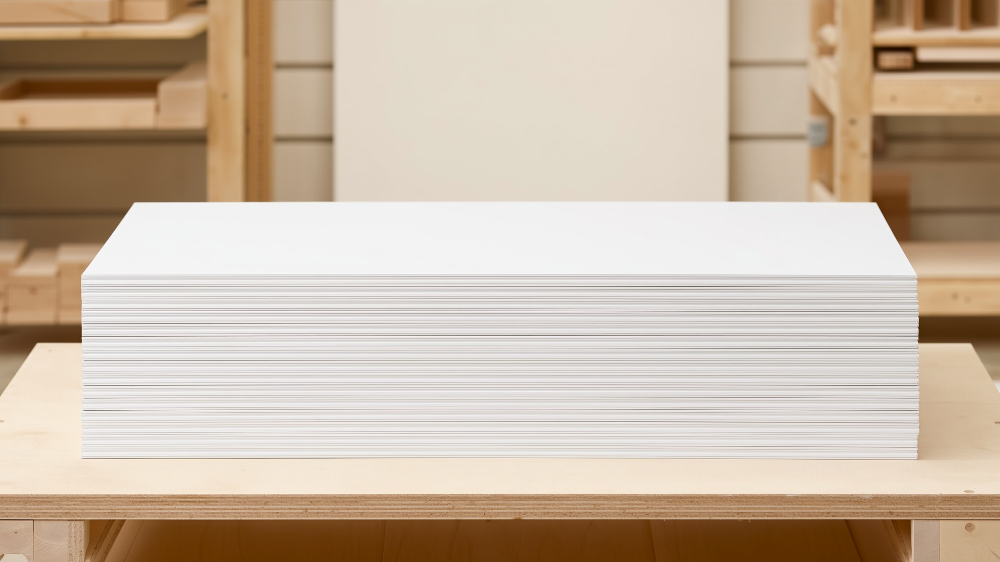
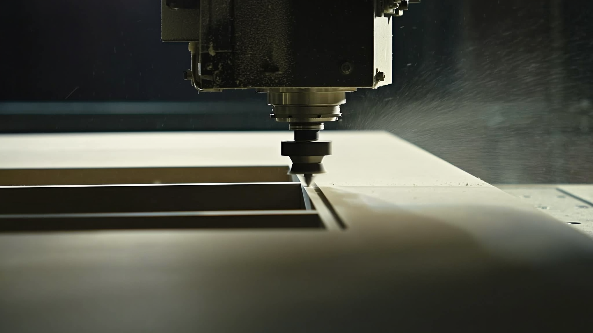

# Social Media Marketing Plan — Cabinet Door Manufacturing

**Prepared for:** [Client Name] *(replace with the client's brand)*
**Prepared by:** [Your Name / Your Business]
**Date:** June 2026
**Channels:** Facebook · Instagram · TikTok (LinkedIn as a Phase 2 add-on)
**Engagement type:** Done-for-you social media management & lead generation

---

## 1. Executive Summary

[Client Name] manufactures cabinet doors on licensed Phill Anton CNC profiles, offered in
three states of finish: **raw, sanded, and primed**. The buyer is not a homeowner — it is a
**cabinet shop, kitchen-and-bath remodeler, or general contractor** who needs a reliable
door supplier they can resell or install under their own brand.

This is a **business-to-business (B2B)** marketing plan. The goal is simple: put a steady,
predictable stream of qualified cabinet-shop leads in front of [Client Name], at a known
cost per lead, using Facebook, Instagram, and TikTok.

The strategy is a **Proof-of-Craft Hybrid**: a consistent engine of short shop-floor and
product video builds credibility and reach for free, while a single always-on paid lead
campaign captures buyers directly inside Facebook and Instagram. As the program proves its
cost per lead, we scale spend and geography deliberately rather than guessing up front.

> **The one promise everything ladders up to:**
> **"Paint-ready consistency, batch after batch."**

---

## 2. Who We're Talking To

We are **not** selling to homeowners. Marketing aimed at the wrong audience is the single
most common way ad budgets get wasted. Our buyer:

| Buyer | What they care about | Where they are |
|-------|---------------------|----------------|
| **Cabinet shops** | Consistent doors they can finish & resell, on time | FB, IG, FB Groups |
| **Kitchen & bath remodelers** | Predictable supply, clean primed surfaces, fewer callbacks | IG, FB |
| **General contractors / builders** | One dependable source, volume pricing | FB, LinkedIn (later) |
| **Cabinet refacing companies** | Door range + finish options in matching profiles | IG, FB |

A purchasing decision-maker at a cabinet shop is a normal person who scrolls Facebook and
Instagram in the evening. Recent industry data shows **nearly half of B2B decision-makers
use Facebook for business research** — Meta is not just a consumer platform. We meet them
where they already are, with content that respects that they're a professional, not a
weekend DIYer.

---

## 3. Positioning & Message Pillars

Every post, ad, and video maps back to one of four pillars. Each pillar is built to kill a
specific fear that makes a cabinet shop hesitate to switch suppliers.

| Pillar | What we say | The buyer fear it removes |
|--------|-------------|---------------------------|
| **Consistency** | Same profile, same dimensions, every single order | "My last supplier's doors didn't match between batches" |
| **Stability** | MDF doesn't expand or contract — it won't crack, swell, or warp like 5-piece solid wood | Warranty callbacks and unhappy customers |
| **Finish-ready** | Factory primer gives a smooth, uniform, paint-ready surface and saves prep labor on site | Wasted shop hours sanding and sealing |
| **Range & flexibility** | Full Phill Anton profile range, available raw / sanded / primed | "I have to source doors from three different places" |

**What we deliberately do NOT advertise:** the CNC operation itself. CNC is *table stakes* —
every serious door maker has it, so leading with "we use CNC machines" says nothing. Instead
we use CNC footage as **proof** inside our content (showing precision and repeatability), not
as a headline feature. This is the difference between bragging and demonstrating.

### The raw / sanded / primed story
Each finish level is positioned for a different buyer need, so the range itself becomes a
selling point:
- **Raw** — for shops that finish in-house and want the lowest cost and full control.
- **Sanded** — a ready-to-prime middle option that saves a labor step.
- **Primed** — factory-primed for a uniform, paint-ready surface; the time-saver that wins
  busy shops. *(Messaging note: pair primed doors with the reminder that a topcoat should
  go on promptly after install — positions [Client Name] as the knowledgeable supplier.)*

---

## 4. Platform Strategy

Each platform has a distinct job. We do not post identical content everywhere blindly — we
repurpose one shoot into platform-appropriate cuts.

| Platform | Primary job | Content style |
|----------|-------------|---------------|
| **Instagram** | Flagship portfolio + Reels — the visual credibility library | Polished product shots, finish comparisons, Reels |
| **Facebook** | Same content + **the paid lead engine** + local Group presence | Lead-form ads, posts, participation in cabinet/contractor Groups |
| **TikTok** | Top-of-funnel reach — get discovered by new shops | Raw, low-polish shop video; unscripted wins here |
| **LinkedIn** | *(Phase 2)* larger / commercial accounts | Company updates, spec content — added only when we pursue bigger buyers |

**Why low-polish video works on TikTok:** in the woodworking/CNC niche, unscripted "watch
this get made" content consistently outperforms over-produced ads. We lean into it — it's
cheaper to make *and* it performs better.

---

## 5. The Funnel — How a Stranger Becomes a Lead

```
   ATTRACT            CAPTURE              NURTURE                 CLOSE
 Reels / TikTok  →  Meta instant     →  Retarget video      →  Sample pack
 shop & product     lead form           viewers + DM/email     → quote → order
 video              (no website hop)
```

1. **Attract** — short video and finish-comparison posts earn reach and saves. Shops that
   would never click an ad will watch a 15-second "raw vs. primed" clip.
2. **Capture** — instead of sending people to a website (where most drop off), we use
   **Facebook/Instagram instant lead forms** that pre-fill the user's contact info inside
   the app. Industry benchmarks show these convert **2–3× better** than website-click ads.
3. **Nurture** — anyone who watched our video or engaged with the page gets retargeted, and
   new leads get a prompt DM/email reply.
4. **Close** — the hook is a **free sample door or sample pack** (a small raw/sanded/primed
   set). It's the single most powerful B2B offer here: a shop that holds the product and
   sees the primer quality is most of the way to ordering. Sample request → quote → order.

---

## 6. Content Engine (Done-For-You System)

A repeatable system is what separates a sustainable program from a burst of posts that
fizzles out. Content rotates through **five buckets** so the feed stays varied and every
post has a job.

| Bucket | Example content | Pillar |
|--------|-----------------|--------|
| **Proof** | Flatness test, edge-consistency close-up, "measure 10 doors, all identical" | Consistency |
| **Process** | CNC cut → sand → prime sequence, satisfying shop footage | Stability / craft |
| **Compare** | Split-screen raw vs. sanded vs. primed; "which finish is right for your shop?" | Range |
| **Educate** | "How to spec your door order," "primed doors: do this after install" | Finish-ready |
| **Social proof** | Customer shop installs, before/after refacing, short testimonials | All |

**Production cadence (per week):**
- 3–4 short videos (Reels / TikTok)
- 2 static or carousel posts
- Each video repurposed across IG, FB, and TikTok (one shoot → many posts)

**Batch production:** one **half-day shop shoot per month** yields ~15–20 clips — enough to
feed the whole month. This keeps the client's time commitment to a few hours a month while
you handle editing, scheduling, and posting.

---

## 7. Paid Advertising Structure

Two campaigns, kept deliberately simple:

1. **Always-on Lead Generation** — instant lead-form ads targeting cabinet makers, kitchen
   & bath pros, remodelers, and GCs by **job title and interest**. Offer = free sample pack
   / quote. Once we have ~50+ leads, we add **lookalike audiences** built from real buyers.
2. **Retargeting** — re-engages anyone who watched ≥ a few seconds of our video or engaged
   with the page. Cheapest, highest-intent audience we have.

**Creative testing discipline:** keep 3–4 ad creatives live at once, review weekly, kill the
losers, and put budget behind winners. This is exactly how a performance agency runs it —
the only difference is scale.

---

## 8. Budget Scenarios

Ad budget is set with the client. Below are three starting points; all figures are **ad
spend paid to Meta**, separate from your management fee. Lead estimates are planning ranges
that we replace with real numbers after the first 30 days.

| Tier | Monthly ad spend | What it funds | Rough expected leads/mo* |
|------|------------------|---------------|--------------------------|
| **Lean** | $300 | Organic engine + light post boosting | 5–15 |
| **Starter** | $800 | + one always-on lead campaign | 15–40 |
| **Growth** | $2,000 | + retargeting, lookalikes, faster testing | 40–100 |

\*Ranges are illustrative for a regional B2B audience and will vary by geography, offer
strength, and creative. We commit to **measured** numbers after the first month, not
promises before it.

**Recommendation:** start at **Starter ($800)** for 30–60 days to find a real cost-per-lead,
then decide whether to scale to Growth. The Lean tier is a valid "test the waters" entry if
the client wants to start smaller.

---

## 9. Geographic Rollout (Phased)

Because shipping bulky doors gets expensive, we **prove the funnel locally before expanding**:

- **Phase 1 — Local / Regional.** Tight geo radius around the shop (pickup + short-haul
  delivery). Cheapest leads, fastest feedback, lowest shipping friction. Goal: establish a
  reliable cost-per-lead and a library of proof content.
- **Phase 2 — Expand.** Once Phase 1 is profitable, widen to freight-shippable regions and
  build **lookalike audiences** from Phase 1 buyers to find similar shops in new markets.

This protects the client's budget: we don't pay to reach shops we can't yet serve
economically.

---

## 10. Measurement & Reporting

We manage to numbers, not vibes. Tracked monthly:

- **Cost per lead (CPL)** — the headline metric
- **Lead → quote rate** and **quote → order rate** (with client input)
- **Organic reach, saves, and follower growth**
- **Retargeting return on ad spend (ROAS)**

Deliverable: a **one-page monthly report** in plain English — what we spent, what came in,
what we're changing next month. No jargon dumps.

---

## 11. How This Compares to a Large Marketing Agency

An honest comparison, because the client deserves one.

**What we match:** the *strategy* is identical to what a good performance agency runs —
audience research, a content engine, a paid lead funnel, retargeting, creative testing, and
reporting dashboards. None of that is proprietary magic; it's disciplined execution.

**Where we're better for a business this size:**
- **Speed & access** — you deal directly with the person doing the work, not an account
  manager relaying to a junior buyer.
- **Cost** — no agency overhead, retainers, or minimum ad spends in the five figures.
- **Niche focus** — content built specifically around cabinet doors and the cabinet-shop
  buyer, not a generic template.

**Where a big agency genuinely has more (no overselling):**
- Large in-house creative/video teams producing high volumes of polished assets.
- Big media budgets that unlock advanced placements and faster data.
- Enterprise attribution software for multi-touch tracking across channels.

**Bottom line:** for a cabinet door manufacturer, the agency's extra horsepower is mostly
aimed at problems this business doesn't have yet. We run the same playbook, leaner and
faster, and the client can graduate to a larger shop later if volume ever demands it.

---

## 12. Ad Creative — Rough Drafts

Four starting concepts, each tied to a pillar. These are **directions to build on** — final
ads should use [Client Name]'s real product photos and shop footage, which will always
outperform stock or AI concept images. Two sample concept images are included as visual
stand-ins:

| Concept image | Use |
|---------------|-----|
|  | Concept C hero — clean primed-stack with headline space on top *(final ad should swap in a real photo showing the shaker profile)* |
|  | Concept A "Process / Flatness" Reel & TikTok cover — ready to use |

### Concept A — "Flatness Test" (Reel / TikTok) · Pillar: Consistency
- **Visual:** Hands lay a straightedge across a primed door; gap = zero. Repeat across a
  stack — every one dead flat. Fast cuts, satisfying.
- **On-screen text:** "We checked 10 doors. Watch what happened." → "Flat. Every. Time."
- **Caption / CTA:** "Consistency you can build a reputation on. Request a free sample pack →"

### Concept B — "Raw → Primed" Split-Screen (Carousel / Reel) · Pillar: Range
- **Visual:** Same profile shown in raw, sanded, and primed side by side; swipe reveals each.
- **On-screen text:** "Three ways to buy. One perfect profile." Labels: RAW · SANDED · PRIMED.
- **Caption / CTA:** "Finish in-house or skip the prep — your call. Get pricing →"

### Concept C — "Free Sample Pack" Lead Ad (Facebook/Instagram lead form) · Pillar: Finish-ready
- **Visual:** Clean hero of a stack of bright white primed shaker doors (see concept image),
  bold headline space at top.
- **Headline:** "Paint-ready cabinet doors. See the finish for yourself — free."
- **Body:** "Cabinet shops: get a free raw/sanded/primed sample pack on the Phill Anton
  profiles. No solid-wood warping. Uniform primer. Consistent every order."
- **CTA button:** "Get my sample pack" → instant lead form.

### Concept D — "Stop Sanding" Problem/Solution (Reel) · Pillar: Finish-ready
- **Visual:** Frustrated shop worker sanding a rough door (problem) → cut to a smooth
  factory-primed door gliding under a paint sprayer (solution).
- **On-screen text:** "Still prepping doors by hand? Factory-primed. Paint-ready. Done."
- **Caption / CTA:** "Save the labor. Order primed → request a quote."

---

## 13. First 90 Days

| Phase | Weeks | Focus |
|-------|-------|-------|
| **Setup** | 1–2 | Audit accounts, set up Meta Business/ads manager, lead form, tracking; first shop shoot |
| **Launch** | 3–6 | Publish content engine; launch Starter lead campaign (Phase 1 geo); test 3–4 creatives |
| **Optimize** | 7–12 | Cut losing ads, scale winners, build first lookalikes, deliver month-1 & month-2 reports; decide on budget/geo expansion |

---

## 14. Next Steps

1. Confirm the **client's brand name, logo, and any existing FB/IG/TikTok handles**.
2. Choose a **starting budget tier** (recommended: Starter, $800/mo ad spend).
3. Confirm **Phase 1 geography** (the radius the client can serve economically today).
4. Schedule the **first half-day shop shoot** for the content library.
5. Agree the **service fee** for done-for-you management (separate from ad spend).

---

*This plan is intentionally lean and measurable. Every tactic is tied to a number we can
report on, and every dollar of ad spend is pointed at the cabinet-shop buyer — never wasted
on the wrong audience.*
